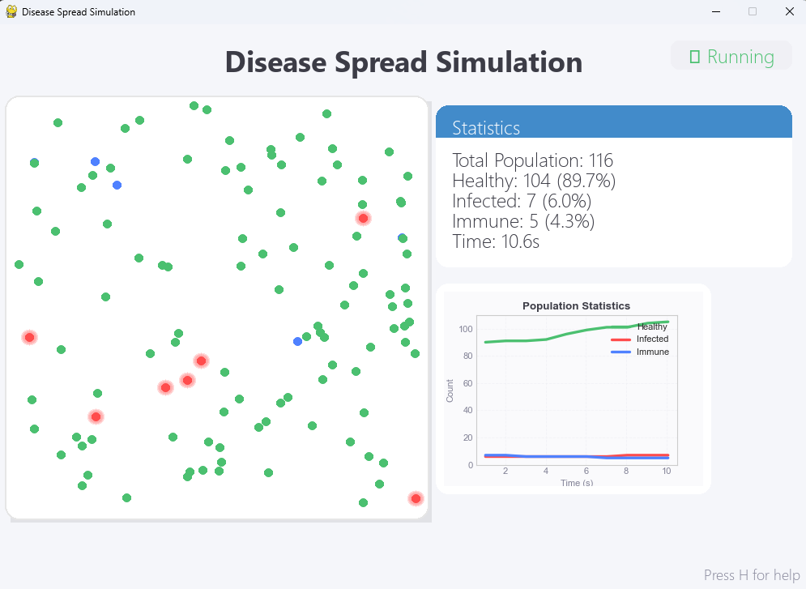

# Disease Spread Simulation

A visual simulation of disease spread dynamics in a population, built with Python and Pygame.

## Overview

This application simulates how diseases spread through a population. It uses state patterns to model different health conditions (healthy, infected, immune) and visualizes the spread of infection over time. The simulation includes various realistic factors such as:

- Social distancing behavior
- Symptomatic vs asymptomatic cases
- Infection probability based on exposure time and distance
- Immunity after recovery
- Population movement patterns




## Features

- 🦠 Real-time visualization of disease spread
- 📊 Live statistics tracking with graphical representation
- ⏱️ State saving and loading functionality
- 🔄 Configurable simulation parameters
- 👥 Social distancing behaviors
- 📈 Data visualization of population health over time

## Installation

1. Clone this repository:

```
git clone https://github.com/your-username/disease-spread-simulation.git
```

2. Install required dependencies:

```
pip install pygame matplotlib numpy
```

3. Run the simulation:

```
python main.py
```

## Controls

- **P**: Pause/Resume simulation
- **S**: Save current simulation state
- **L**: Load last saved state
- **H**: Show help screen
- **R**: Reset simulation

## How It Works

The simulation uses the State design pattern to model the health state of each person in the population. People move around the simulation area and can infect others based on proximity and exposure time.

### States:

- **Healthy**: Can be infected when exposed to infected individuals
- **Infected**: Can spread disease to healthy individuals; recovers after a period
- **Immune**: Cannot be infected or spread disease

### Infection Mechanics:

- Requires close proximity (< 2m) for a minimum duration (3+ seconds)
- Symptomatic carriers have higher infection probability
- Social distancing reduces infection chance
- Distance affects infection probability

## Contributing

Contributions are welcome! Please feel free to submit a Pull Request.

## License

This project is licensed under the MIT License - see the LICENSE file for details.
